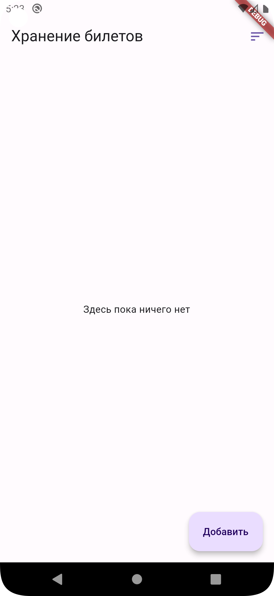

# Целевая платформа

Android, pixel 5, API 29

# Результаты
<ol>
<li>Сделал экран с пустым состоянием 

</li>
<li>
По клику на кнопку добавить появляется BottomSheet, в который можно ввести url. Если в буфере обмена уже имеется ссылка на pdf-файл, то ссылка вставится автоматически. Также появляется снекбар 

 
</li>
<li>
Валидация данных: нельзя ввести неверный url и файл не расширения pdf 

 
</li>
<li>
Сделано сохранение данных локально в БД 
 
</li>
<li>
Кнопка скрывается, когда достигает конца списка 

 
</li>
<li>
По нажатию на кнопку, файл скачивается, также меняются иконки в зависимости от состояния. Можно удалить файл и тикет при помощи свайпа  

 
</li>
<li>
Можно просмотреть pdf-файл - необходимо осуществить LongPress 

 
</li>
<li>
Можно отсортировать файлы по дате и состоянию загрузки. 

 
</li>
<li>
Для локального хранения данных использовал drift. 
 
</li>
</ol>

 Что хотел сделать и не получилось: 

<ul> <li>Продолжение загрузки после паузы.</li> </ul>
 

Что не успел:
<ul>
<li>Выбор отдельных файлов и их скачивание.</li>
<li>Загрузку всех незагруженных файлов по одной кнопке.</li>
<li>Проблемы с перестроением списков.</li>
<li>Различные анимации для кнопок, смещения списка при удалении, сортировки.</li>
</ul>